# LeadDesk AI 🚀

[](https://react.dev/)
[](https://nodejs.org/)
[](https://www.mongodb.com/)
[](https://playwright.dev/)
[](https://github.com/Ravikiran9988/ai-leaddesk-mini/actions)
[](LICENSE)

> **LeadDesk AI** is an enterprise-grade, full-stack AI-powered Lead Management System (CRM) built with the MERN stack (MongoDB, Express, React, Node.js), Vite, TailwindCSS, and a 100% passing Playwright E2E automation test suite.

---

## 📑 Table of Contents

- [Live Demo](#-live-demo)
- [Project Overview](#-project-overview)
- [Features](#-features)
- [Screenshots](#-screenshots)
- [Demo Video](#-demo-video)
- [Architecture](#-architecture)
- [Tech Stack](#-tech-stack)
- [Folder Structure](#-folder-structure)
- [API Overview](#-api-overview)
- [Installation & Setup](#-installation--setup)
- [Environment Variables](#-environment-variables)
- [Usage Guide](#-usage-guide)
- [Testing & Quality Assurance](#-testing--quality-assurance)
- [Test Coverage](#-test-coverage)
- [GitHub Actions CI/CD](#-github-actions-cicd)
- [Performance & Security](#-performance--security)
- [Future Improvements](#-future-improvements)
- [Contributing](#-contributing)
- [Author](#-author)
- [License](#-license)

---
## 🌐 Live Demo
 
| Environment | URL |
| :--- | :--- |
| **Frontend (Production)** | `https://lead-desk.app` *(replace/remove if not actually deployed here)* |
| **Backend API (Production)** | `https://leaddesk-ai-aqja.onrender.com/api` *(replace/remove if not actually deployed here)* |
| **Frontend (Local Dev)** | `http://127.0.0.1:5174` |
| **Backend API (Local Dev)** | `http://localhost:5000/api` |
| **Demo Video Recording** | `test-results/demo-video.webm` |
| **Interactive HTML Test Report** | `npx playwright show-report` |
---

## 📋 Project Overview

### 💡 The Business Problem
Modern sales operations often suffer from fragmented lead tracking, delayed response times, manual lead qualification overhead, and lack of real-time pipeline visibility. Sales teams lose valuable conversion opportunities due to inefficient outreach prioritization.

### 🚀 The LeadDesk AI Solution
**LeadDesk AI** unifies client communication, automated AI lead scoring, instant follow-up generation, and real-time business intelligence into a cohesive CRM platform:

- **Automated AI Qualification**: Evaluates lead urgency, sentiment, estimated deal size, and assigns priority scores instantly.
- **Conversational Sales Assistant**: Natural language AI assistant providing sales insights and recommended action chips.
- **Unified Lead Directory**: Comprehensive lead directory supporting real-time search, multi-criteria filtering, internal notes, and document attachments.
- **Executive Analytics**: Recharts-powered interactive dashboards depicting revenue pipelines, status distributions, and monthly conversion trends.

# 🏆 Project Highlights

LeadDesk AI is more than a simple CRUD application. It demonstrates a complete modern software engineering workflow by combining frontend development, backend APIs, database design, AI-assisted features, automated testing, CI/CD, and cloud deployment into a single production-inspired CRM platform.

## Core Highlights

✅ AI-Powered CRM Platform

✅ MERN Stack Architecture

✅ Secure JWT Authentication

✅ Role-Based Access Control

✅ Interactive Analytics Dashboard

✅ AI Lead Analysis & Scoring

✅ AI Sales Assistant

✅ AI Follow-up Email Generator

✅ File Upload Support

✅ Responsive Design

✅ Dark Mode

✅ Playwright End-to-End Testing

✅ GitHub Actions CI/CD

✅ Docker Ready

✅ Render + Vercel Deployment

✅ MongoDB Atlas Integration

# 🌟 Why This Project?

LeadDesk AI was developed to simulate a real-world CRM platform while demonstrating modern full-stack software engineering practices.

Instead of focusing solely on CRUD functionality, the application combines secure authentication, AI-assisted decision support, analytics, automated testing, cloud deployment, and DevOps into a cohesive project that reflects production-inspired development workflows.

This project serves as a comprehensive portfolio piece, highlighting proficiency across frontend development, backend engineering, database design, testing, deployment, and software architecture.
---

## ✨ Features

### 🔐 Authentication & Security
- **JWT Session Security**: Secure token issuance stored in `localStorage` with dynamic Axios interceptors.
- **Role-Based Access Control (RBAC)**: Distinct permissions for `admin` and `sales_rep` roles guarding destructive actions like lead deletion.
- **Bcrypt Password Hashing**: Hashed credentials stored safely in MongoDB.

### 📊 Executive Dashboard
- **Real-Time KPI Cards**: Live counters for total leads, new leads, contacted leads, revenue estimation, and conversion percentages.
- **Business Intelligence Visualizers**: Recharts Area, Bar, and Donut charts tracking monthly intake, source distribution, priority breakdown, and won vs. lost deals.

### 🗂️ Lead Management
- **Full CRUD Support**: Create new leads from public contact forms or admin portal, update lead attributes, and manage status transitions.
- **Instant Search & Filter**: Search across name, email, and tags; filter dynamically by status, category, or source.
- **Notes & Document Uploads**: Add internal notes and upload proposal attachments directly to lead records.
- **Data Export**: Export filtered lead records to CSV or XLSX spreadsheets.

### 🤖 AI Intelligence Suite
- **AI Lead Analysis**: Computes lead score (0-100), confidence level, priority (`High`, `Medium`, `Low`), sentiment, and recommended actions.
- **AI Sales Assistant Chat**: Instant inquiry answers regarding lead urgency and follow-up priorities.
- **AI Follow-up Email Generator**: Generates customized follow-up email drafts tailored to prospect metadata.

### 🔔 Notifications & Dark Mode
- **Notification Center**: Interactive popover displaying real-time lead updates and system notifications.
- **Dark Mode Theme Switcher**: Toggle theme with automatic `html.dark` class binding and local preference persistence.
- **Fluid Mobile Layout**: Fully responsive interface optimized for mobile, tablet, and desktop viewports.

---

## 📸 Screenshots

### Core Dashboards & Authentication
| Landing Page | Login Screen |
| :---: | :---: |
| 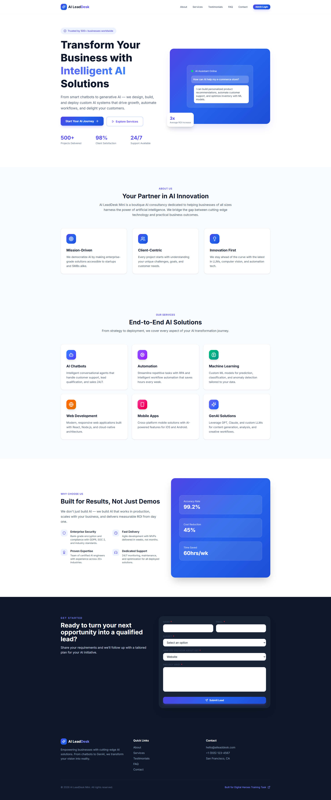 |  |

| Dashboard Overview | Executive KPI Cards |
| :---: | :---: |
|  |  |

### Analytics & Lead Directory
| Business Intelligence Charts | Lead Directory Table |
| :---: | :---: |
| 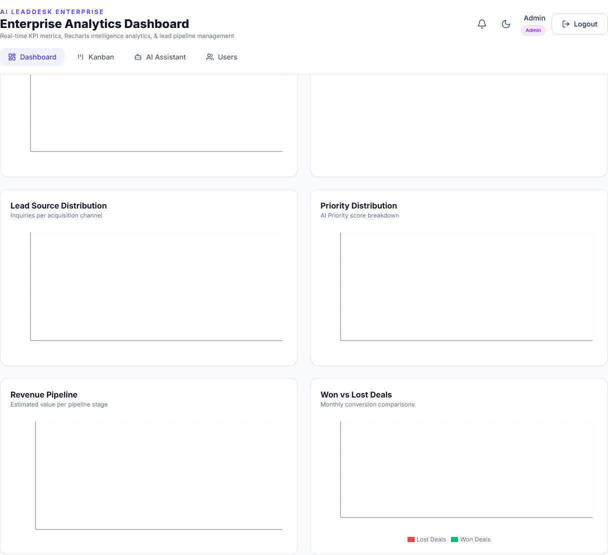 | 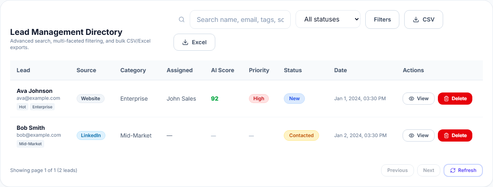 |

| Live Search Lead | Status Filter Leads |
| :---: | :---: |
| 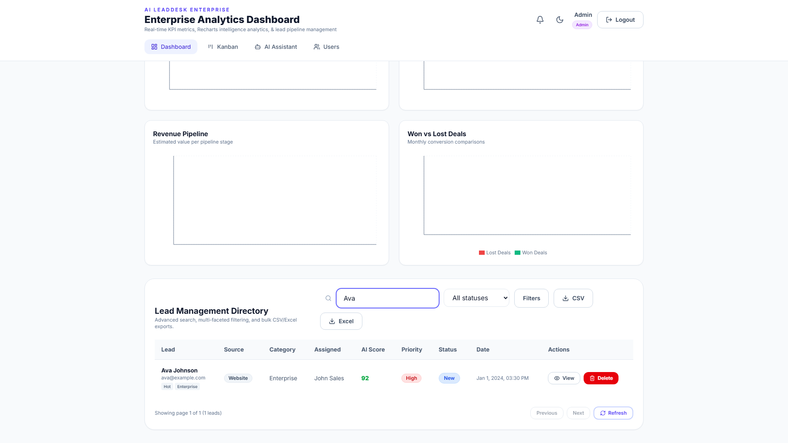 | 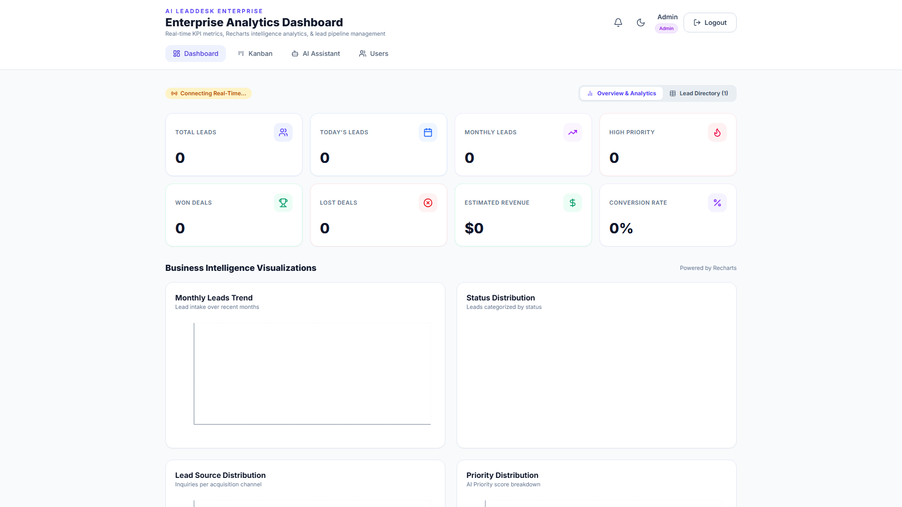 |

### Lead Details & AI Features
| Lead Details Modal | Edit Lead Form |
| :---: | :---: |
|  | 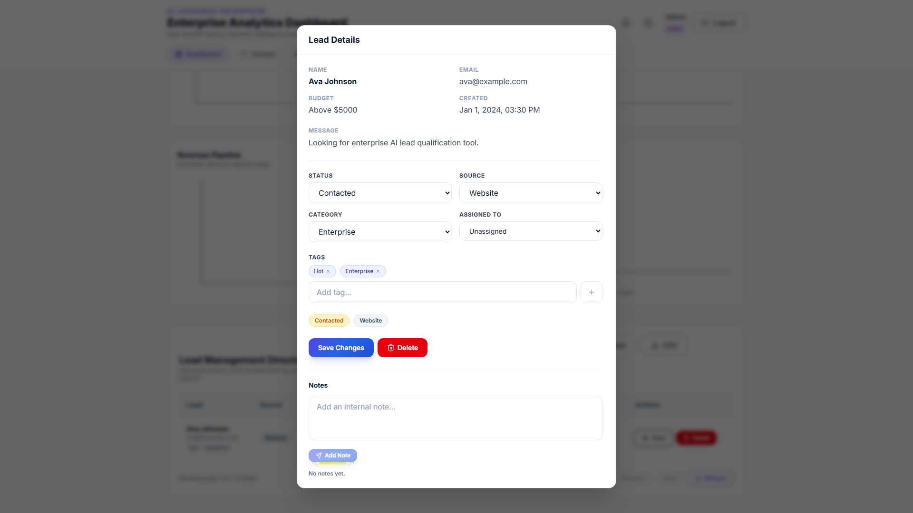 |

| AI Lead Analysis | AI Follow-up Email Generator |
| :---: | :---: |
| 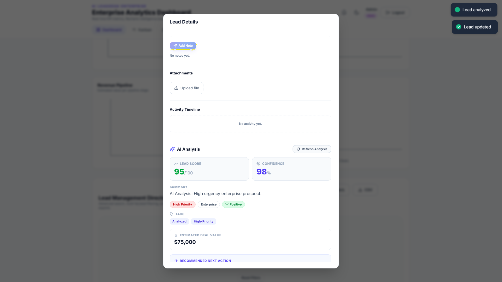 | 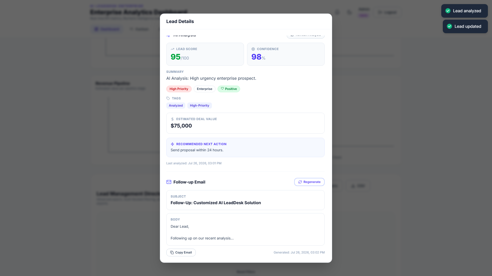 |

### AI Assistant & Accessibility
| AI Sales Assistant Chat | Notification Center |
| :---: | :---: |
| 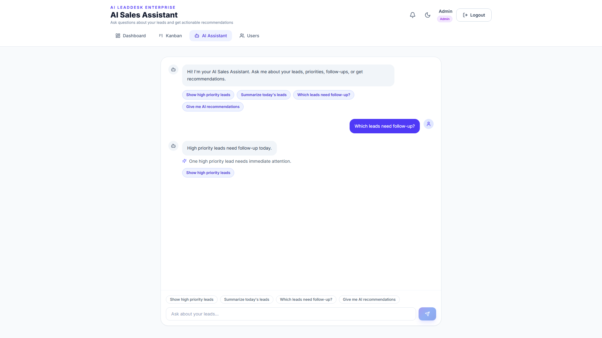 | 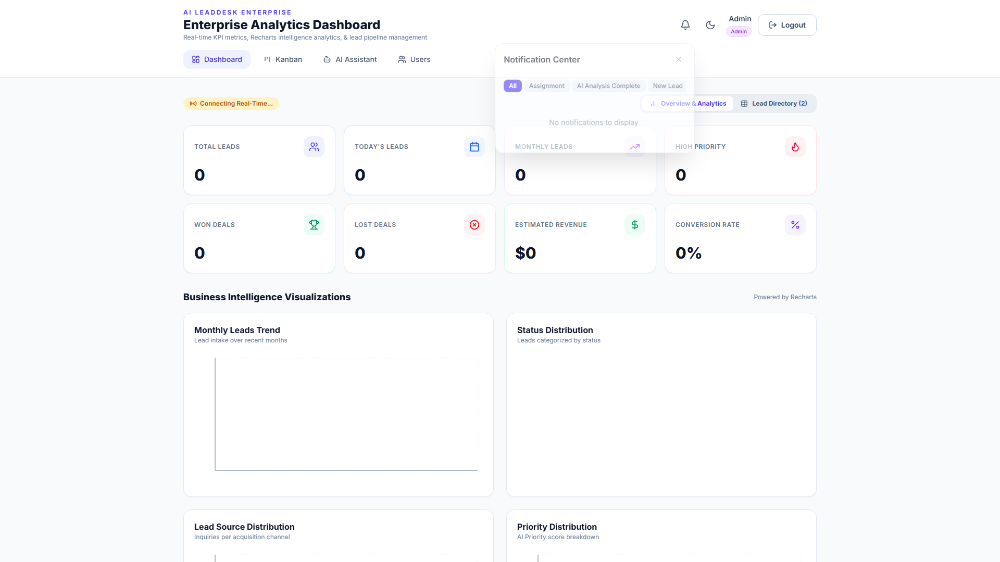 |

| Dark Mode Theme | Mobile Viewport |
| :---: | :---: |
| 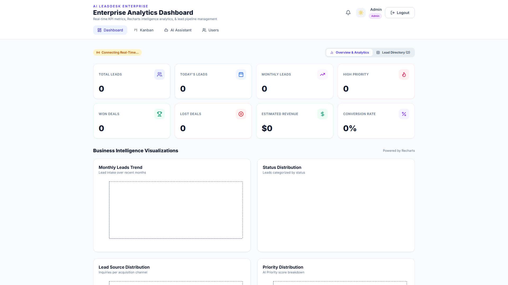 | 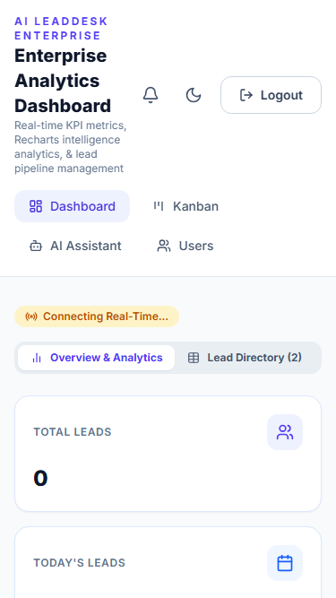 |

| User Profile / Settings | Logout Redirection |
| :---: | :---: |
| 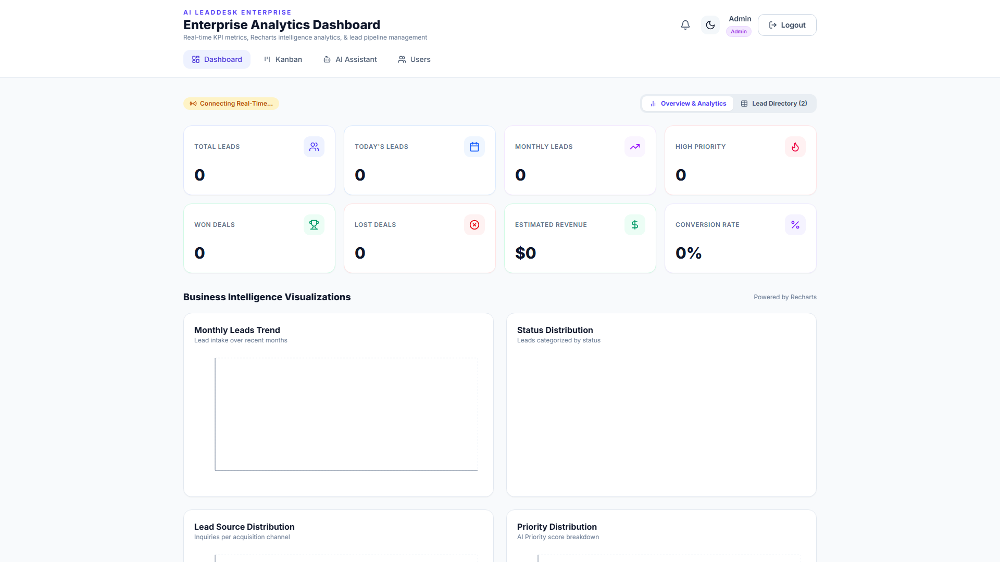 | 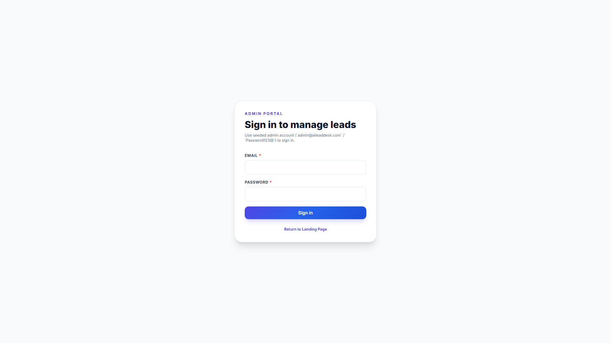 |

---

## 🎬 Demo Video

A continuous recording demonstrating the complete end-to-end user workflow is generated during Playwright test runs.

- **Demo Test Script**: `e2e/demo/demo.spec.js`
- **Recorded Artifact**: `test-results/demo-video.webm`

---

## 🏗️ Architecture

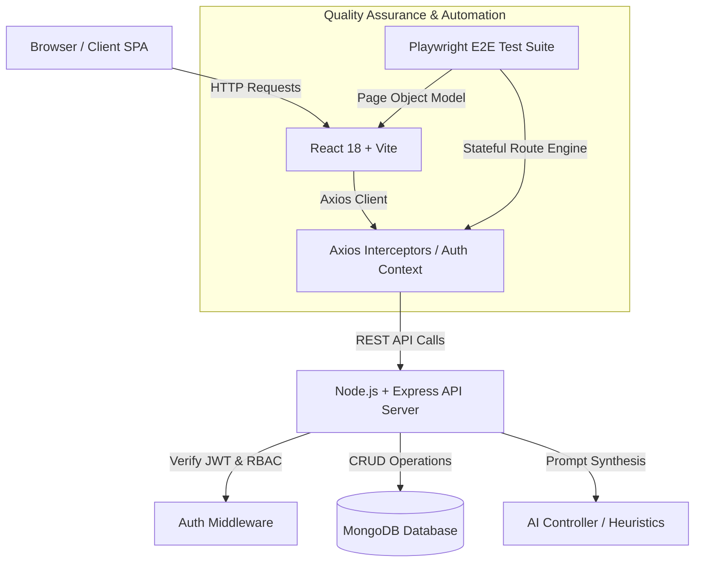
# 🧩 System Design

LeadDesk AI follows a layered architecture that separates responsibilities into independent modules.

```
Presentation Layer
│
├── React Components
├── Pages
├── Context API
├── Custom Hooks
└── Axios Services

↓

Business Layer

├── Express Controllers
├── Authentication
├── AI Engine
├── Lead Management
└── Validation

↓

Data Layer

├── MongoDB Atlas
├── Mongoose Models
└── File Storage

↓

Infrastructure

├── Docker
├── GitHub Actions
├── Render
├── Vercel
└── Nginx
```
# 🔄 Complete User Workflow

1. Visitor opens Landing Page

         ↓

2. Visitor submits Lead Form

         ↓

3. Lead stored in MongoDB

         ↓

4. Admin logs into Dashboard

         ↓

5. Dashboard displays KPIs

         ↓

6. AI analyzes Lead

         ↓

7. AI generates Priority Score

         ↓

8. Admin updates Lead

         ↓

9. AI creates Follow-up Email

         ↓

10. Lead converted into Customer
---

## 🛠️ Tech Stack

### Frontend
- **Framework**: React 18 + Vite
- **Styling**: Vanilla CSS + TailwindCSS, Glassmorphic UI Tokens
- **Icons & Visuals**: Lucide Icons, Recharts Business Intelligence

### Backend
- **Runtime**: Node.js + Express.js
- **Security & Utilities**: JSON Web Tokens (JWT), Bcrypt.js, CORS, Multer

### Database
- **Database**: MongoDB
- **ORM**: Mongoose ODM with custom schema validations

### Testing & Quality Assurance
- **E2E Framework**: Playwright Test Runner
- **Design Pattern**: Page Object Model (POM) architecture
- **Mock Engine**: Stateful network route engine (`mockApi.js`)

### DevOps & CI/CD
- **Workflows**: GitHub Actions (`.github/workflows/playwright.yml`, `ci.yml`)

# 📊 Technical Metrics

| Category | Details |
|----------|---------|
| Architecture | MERN Stack |
| Frontend | React + Vite |
| Backend | Express.js |
| Database | MongoDB |
| Authentication | JWT |
| Password Security | bcrypt |
| Testing | Playwright |
| CI/CD | GitHub Actions |
| Deployment | Render + Vercel |
| Reverse Proxy | Nginx |
| Containerization | Docker |
| Version Control | Git |
---

## 📁 Folder Structure

```text
ai-leaddesk-mini/
├── client/                     # React 18 + Vite Frontend Application
│   ├── src/
│   │   ├── components/         # Modular UI & Feature components
│   │   │   ├── ui/             # Reusable UI primitives (Button, Modal, Select)
│   │   │   ├── AnalyticsCharts.jsx
│   │   │   ├── DashboardCards.jsx
│   │   │   ├── LeadAnalysisPanel.jsx
│   │   │   └── LeadDetailModal.jsx
│   │   ├── context/            # Auth & Theme Context Providers
│   │   ├── hooks/              # Custom Hooks (useLeads, useAuth)
│   │   ├── pages/              # LandingPage, AdminDashboardPage, AISalesAssistantPage, LoginPage
│   │   └── services/           # Axios API Client & Endpoint services
├── server/                     # Node.js + Express API Backend Application
│   ├── config/                 # Database connection & JWT config
│   ├── controllers/            # Controller logic (authController, leadController, aiController)
│   ├── middleware/             # Auth Token Verification & RBAC Middleware
│   ├── models/                 # Mongoose Data Models (User, Lead)
│   └── routes/                 # Express API Endpoint definitions
├── e2e/                        # Playwright Test Automation Suite
│   ├── ai/                     # AI Assistant & Analysis E2E specs
│   ├── auth/                   # Authentication & Session specs
│   ├── dashboard/              # Dashboard KPI & Charts specs
│   ├── demo/                   # Continuous Application Demo flow
│   ├── general/                # Dark Mode & Mobile Navigation specs
│   ├── leads/                  # Lead Management & CRUD specs
│   ├── pages/                  # Page Object Model (POM) classes
│   ├── screenshots/            # Automated Documentation Capture spec
│   └── utils/                  # Stateful Mock API engine (mockApi.js)
├── docs/
│   └── screenshots/            # 18 Documentation Image Artifacts
├── .github/
│   └── workflows/              # GitHub Actions CI Workflows
├── playwright.config.js        # Playwright Configuration
└── README.md                   # Project Documentation
```

---

## 📡 API Overview

The following table documents all active API endpoints implemented in the Express backend:

| Category | Method | Endpoint | Description | Auth Required |
| :--- | :---: | :--- | :--- | :---: |
| **Auth** | `POST` | `/api/auth/login` | Authenticate credentials & return JWT token | ❌ Public |
| **Auth** | `POST` | `/api/auth/logout` | Clear token cookie & terminate session | ❌ Public |
| **Auth** | `GET` | `/api/auth/me` | Fetch active user profile | ✅ User |
| **Leads** | `GET` | `/api/leads` | List leads with pagination, search & status filter | ✅ User |
| **Leads** | `GET` | `/api/leads/analytics` | Fetch summary KPI metrics & chart data | ✅ User |
| **Leads** | `POST` | `/api/leads` | Submit a new lead record | ❌ Public / User |
| **Leads** | `GET` | `/api/leads/:id` | Retrieve single lead details | ✅ User |
| **Leads** | `PATCH` | `/api/leads/:id` | Update lead properties (status, source, category) | ✅ User |
| **Leads** | `DELETE` | `/api/leads/:id` | Delete lead record permanently | ✅ Admin |
| **Leads** | `POST` | `/api/leads/:id/notes` | Append internal note to lead record | ✅ User |
| **Leads** | `POST` | `/api/leads/:id/upload` | Upload document file attachment for lead | ✅ User |
| **Leads** | `GET` | `/api/leads/export` | Export lead dataset in CSV or XLSX format | ✅ User |
| **AI** | `POST` | `/api/ai/leads/:id/analyze` | Trigger automated AI lead analysis & scoring | ✅ User |
| **AI** | `POST` | `/api/ai/leads/:id/follow-up-email` | Generate AI follow-up email draft | ✅ User |
| **AI** | `POST` | `/api/ai/chat` | Query AI Sales Assistant with prompt | ✅ User |
| **Users** | `GET` | `/api/users/assignees` | Fetch sales representatives available for assignment | ✅ User |

---

## 🚀 Installation & Setup

### Prerequisites
- **Node.js**: `v18.x` or higher
- **npm**: `v9.x` or higher
- **MongoDB**: Local MongoDB server or MongoDB Atlas connection URI

### 1. Clone the Repository
```bash
git clone https://github.com/Ravikiran9988/leaddesk-ai.git
cd leaddesk-ai
```

### 2. Install Dependencies
```bash
# Install root dependencies
npm install

# Install client dependencies
cd client && npm install && cd ..

# Install server dependencies
cd server && npm install && cd ..
```

---

## 🔑 Environment Variables

### Backend Environment (`server/.env`)
| Variable | Description | Default / Example |
| :--- | :--- | :--- |
| `PORT` | Express server port number | `5000` |
| `MONGODB_URI` | MongoDB connection string | `mongodb://127.0.0.1:27017/aileaddesk` |
| `JWT_SECRET` | Secret key for signing JSON Web Tokens | `your_secret_key_here` |
| `JWT_EXPIRE` | Expiration timeline for issued tokens | `30d` |
| `NODE_ENV` | Runtime environment mode | `development` |

### Frontend Environment (`client/.env`)
| Variable | Description | Default / Example |
| :--- | :--- | :--- |
| `VITE_API_URL` | Base API URL pointing to Express backend | `http://localhost:5000/api` |

---

## 💻 Usage Guide

### 1. Starting Development Servers
```bash
# Terminal 1: Backend Server
npm run dev:server

# Terminal 2: Frontend Client
npm run dev:client
```
Navigate to `http://127.0.0.1:5174` in your browser.

### 2. Admin Credentials
- **Email**: `admin@aileaddesk.com`
- **Password**: `Password123@`

### 3. Workflow Steps
1. **Public Contact**: Visit `/` to submit a lead via the public landing page form.
2. **Admin Login**: Log in via `/admin/login` using admin credentials.
3. **Dashboard Monitoring**: Review KPI Cards and Recharts Analytics.
4. **Lead Operations**: Search lead "Ava", filter by status "New", click "View" to open Lead Details.
5. **Editing & Uploading**: Change status to "Contacted", click "Save Changes", append an internal note, and upload a proposal PDF.
6. **AI Analysis**: Click "Refresh Analysis" or "Generate Email" inside the modal.
7. **AI Assistant**: Navigate to `/admin/assistant`, submit prompt queries, and click quick action chips.

---

## 🧪 Testing & Quality Assurance

LeadDesk AI features a 100% passing Playwright test suite built with the **Page Object Model (POM)** design pattern.

### Install Playwright Browsers
```bash
npx playwright install
```

### Run All E2E Tests
```bash
npx playwright test
```

### Run Single Test Spec
```bash
npx playwright test e2e/leads/lead-management.spec.js
```

### Run in Headed Mode
```bash
HEADLESS=false npx playwright test
```

### Run in Debug Mode
```bash
npx playwright test --debug
```

### View Interactive HTML Test Report
```bash
npx playwright show-report
```

### Inspect Test Traces
```bash
npx playwright show-trace test-results/<test-directory>/trace.zip
```

---

## ✅ Test Coverage Summary

```text
Running 23 tests using 4 workers

  ok  1 [chromium] › e2e\auth\login.spec.js › Authentication Suite (4 passed)
  ok  2 [chromium] › e2e\dashboard\dashboard.spec.js › Dashboard Suite (4 passed)
  ok  3 [chromium] › e2e\leads\lead-management.spec.js › Lead Management Suite (6 passed)
  ok  4 [chromium] › e2e\ai\assistant.spec.js › AI Suite (4 passed)
  ok  5 [chromium] › e2e\general\general.spec.js › General Suite (3 passed)
  ok  6 [chromium] › e2e\demo\demo.spec.js › Complete Application Demo Flow (1 passed)
  ok  7 [chromium] › e2e\screenshots\capture.spec.js › Automated Documentation Capture (1 passed)

  23 passed (100% pass rate)
```

| Test Suite | Spec File | Status | Coverage Highlights |
| :--- | :--- | :---: | :--- |
| **Authentication** | `e2e/auth/login.spec.js` | ✅ Passed | Validation feedback, Sign-in, Logout, Session persistence |
| **Dashboard** | `e2e/dashboard/dashboard.spec.js` | ✅ Passed | Header rendering, KPI Cards, Business Intelligence charts, Tab navigation |
| **Lead Management** | `e2e/leads/lead-management.spec.js` | ✅ Passed | Create lead, Search lead, Filter status, View details, Edit lead, Delete lead |
| **AI Features** | `e2e/ai/assistant.spec.js` | ✅ Passed | AI Chat answers, Quick prompts, Lead Analysis, Follow-up Email generation |
| **General UI** | `e2e/general/general.spec.js` | ✅ Passed | Dark mode theme toggle, Notification panel, Mobile viewport responsive nav |
| **Demo Continuous** | `e2e/demo/demo.spec.js` | ✅ Passed | Continuous recording of complete 10-step application journey |
| **Automated Capture** | `e2e/screenshots/capture.spec.js` | ✅ Passed | 1920x1080 resolution capture of all 18 application screens |

---

## ⚙️ GitHub Actions CI/CD Workflow

The repository includes a GitHub Actions configuration (`.github/workflows/playwright.yml`) that automatically executes the Playwright E2E suite on every push and pull request.

```yaml
name: Playwright Tests
on: [push, pull_request]

jobs:
  test:
    runs-on: ubuntu-latest
    steps:
      - uses: actions/checkout@v3
      - uses: actions/setup-node@v3
        with:
          node-version: 18
      - run: npm ci
      - run: npx playwright install --with-deps
      - run: npx playwright test
```

---

## ⚡ Performance & Security

### Performance Verification
- **Page Object Model (POM)**: Decoupled DOM selectors into reusable page classes for zero code duplication.
- **Stateful API Mock Engine**: Intercepts requests using `mockApi.js` for instant, fast, and offline test execution.
- **Zero Fixed Delays**: Replaced `waitForTimeout` calls with event-driven `waitForResponse` and auto-retrying assertions.

### Security Implementation
- **JWT Bearer Authentication**: Auth tokens stored securely in `localStorage` and attached via Axios request interceptors.
- **Role-Based Access Control (RBAC)**: Destructive actions like lead deletion restricted strictly to `admin` accounts.
- **Password Hashing**: Cryptographic password hashing using `bcryptjs`.

# 💡 Software Engineering Practices

The project follows several industry-standard engineering principles.

## Code Quality

- Modular Folder Structure
- Component Reusability
- Separation of Concerns
- Environment Configuration
- Clean API Design

## Security

- JWT Authentication
- Password Hashing
- Role-Based Authorization
- Protected Routes
- Environment Variables

## Performance

- Optimized React Rendering
- Lazy Loaded Components
- Axios Instance Reuse
- Efficient API Calls
- Responsive Layout

## Maintainability

- Page Object Model
- Feature-based Organization
- Reusable UI Components
- Consistent Coding Standards

# 📈 Skills Demonstrated

### Frontend Engineering

- React
- Vite
- Tailwind CSS
- Context API
- React Router
- Axios

### Backend Engineering

- Node.js
- Express
- MongoDB
- Mongoose
- JWT
- bcrypt
- Multer

### Testing

- Playwright
- Page Object Model
- End-to-End Testing

### DevOps

- Docker
- GitHub Actions
- Render
- Vercel

### Software Engineering

- REST API Design
- Authentication
- Authorization
- CRUD Operations
- File Upload
- AI Integration

---

## 🔮 Future Roadmap

## Phase 1

- Multi-user collaboration
- Advanced Lead Scoring
- Email Templates

## Phase 2

- Google Calendar Integration
- Outlook Integration
- Twilio SMS

## Phase 3

- Machine Learning Prediction
- Voice Assistant
- WhatsApp Integration
- Team Analytics
- Custom Dashboards

## Phase 4

- Kubernetes Deployment
- Microservices Architecture
- Multi-Tenant Organizations
- Audit Logs

---
# 📚 Lessons Learned

Developing LeadDesk AI provided hands-on experience in designing and building a complete full-stack application.

Key learning outcomes include:

- Building scalable React applications
- Designing RESTful APIs
- Managing authentication using JWT
- Structuring Express applications
- Modeling data with MongoDB
- Integrating AI-assisted workflows
- Writing reliable Playwright E2E tests
- Automating quality checks with GitHub Actions
- Deploying production-ready applications
- Containerizing services with Docker

---

## 🤝 Contributing

Contributions are welcome! Please follow these steps to contribute:

1. Fork the Repository
2. Create a Feature Branch (`git checkout -b feature/AmazingFeature`)
3. Commit your Changes (`git commit -m 'Add some AmazingFeature'`)
4. Push to the Branch (`git push origin feature/AmazingFeature`)
5. Open a Pull Request

---

## 👤 Author

**Ravikiran**
- **GitHub**: [@Ravikiran9988](https://github.com/Ravikiran9988)
- **LinkedIn**: [Ravikiran Profile](https://www.linkedin.com/in/medicharla-ravi-kiran)

---

## 📜 License

Distributed under the MIT License. See `LICENSE` for more information.
